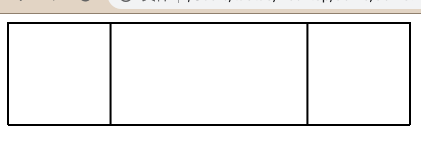

### Flex布局

---

1. ##### 什么是Flex布局

   - ###### Flex布局为“弹性布局”，设置了 `display:flex` 的元素为“Flex容器”，即 `flex container` ,其子元素为 `flex item` ,任何一个元素都可以设置 “Flex容器”

2. ##### Flex结构的组成

   - `flex container`  `flex item` 

   - ###### 容器默认存在 水平轴 和 垂直轴 ，水平轴开始位置是 main-start，结束位置为main-end，垂直轴对应为 cross-start，cross-end。项目默认沿主轴排列，单个项目占据的主轴空间为 main size，交叉空间为 cross size

3. ##### 常用的Flex的属性

   - ###### 容器的属性

     - ###### flex-direction(决定主轴排列方向)	row、row-reverse、column、column-reverse

     - ###### flex-wrap（判断是否换行） nowarp、warp、wrap-reverse

     - ###### justify-content（项目在主轴上的对齐方式）flex-start、flex-end、center、space-between、spance-around

     - ###### align-items（项目在垂直轴上如何对齐）flex-start、flex-end、center、baseline、stretch

     - ###### align-content（多根轴线的对齐方式）flex-start、flex-end、center、space-between、space-around、strech

   - ###### 项目的属性

     - ###### order	（定义项目排列顺序，越靠前越小）

     - ###### flex-grow  （定义项目放大比例）

     - ###### flex-shrink （定义项目缩小比例）

     - ###### flex-basis （定义项目在分配多余空前前，占据的主轴空间）

     - ###### flex （2，3，4的简写）

     - ###### align-self （允许单个单个项目与其他项目有不同的对齐方式）

4. ##### 左右两列布局，上下布局事例

   - ###### 左右两列布局

     ```javascript
     <!DOCTYPE html>
     <html lang="en">
     <head>
         <meta charset="UTF-8">
         <meta name="viewport" content="width=device-width, initial-scale=1.0">
         <title>Document</title>
     </head>
     <body>
         <div class="content">
             <div class="side"></div>
             <div class="center"></div>
             <div class="side"></div>
         </div>
     </body>
     
     <style>
         div{
             border: 1px solid black;
             height: 100px;
         }
         .content{
             display: flex;
             width: 400px;
         }
         .side{
             width: 100px;
         }
         .center{
             flex: 1;
         }
     </style>
     </html>
     ```

     

   - ###### 上下布局

     ```javascript
     <!DOCTYPE html>
     <html lang="en">
     <head>
         <meta charset="UTF-8">
         <meta name="viewport" content="width=device-width, initial-scale=1.0">
         <title>Document</title>
     </head>
     <body>
         <div class="content">
             <div class="side"></div>
             <div class="center"></div>
             <div class="side"></div>
         </div>
     </body>
     
     <style>
         div{
             border: 1px solid black;
             height: 100px;
         }
         .content{
             display: flex;
             flex-direction: column;
             height: 400px;
             width: 400px;
         }
         .side{
             height: 100px;
         }
         .center{
             flex: 1;
         }
     </style>
     </html>
     ```

     

