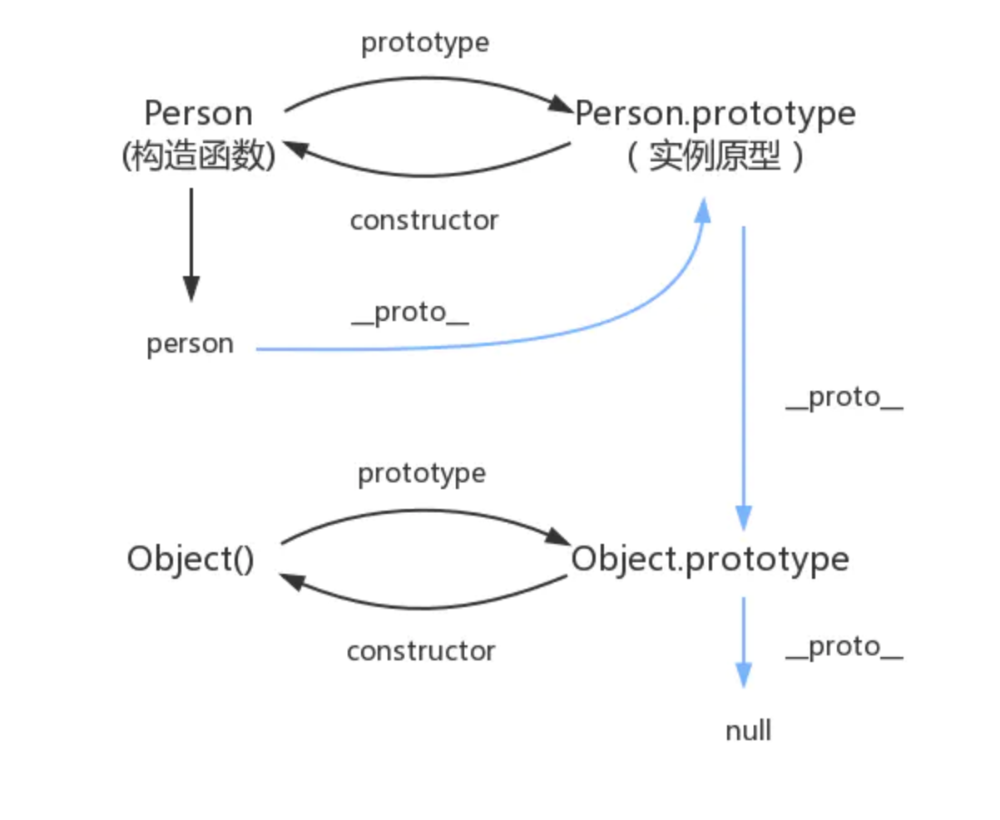

### js中的原型与继承

--------

1. #### 继承的理解

   - ###### 继承是使得子类具有父类的各种属性和方法

   - ###### js中没有类的概念，所以继承是基于原型的继承
   
2. #### 实例对象的两种属性

   - ###### 实例属性：定义在构造方法中

   - ###### 原型属性：定义在原型方法中

   - ###### 可以使用hasOwnProperty进行区分

3. #### js继承的6种方式

   1. #####  原型链继承

      - ###### 令新实例的原型指向父类

        ```javascript
            // 定义一个父类 Hero
            function Hero(name){
                this.name = name//实例属性
                this.run = function(){
                    console.log('run fast')
                }
            }
        
            // 定义 fly height
            Hero.prototype.fly = function(){//原型属性
                console.log('i can fly')
            }
        
            Hero.prototype.height = '180cm'
        
            function Man(){
                this.name = 'man'
            }
        
            Man.prototype = new Hero()//令新实例的原型指向父类
        
            let newMan = new Man()
            newMan.run()//run fast
            console.log(newMan.height)// 180cm
        ```
        
       - ###### 优点：同名属性可覆盖，实例属性与原型属性皆可继承
      
    - ###### 缺点：新建实例无法像父类传参，所有实例共享父类属性
   
2. ##### 构造函数继承
   
   - ###### 通过构造函数.call() .apply() 讲父类构造函数 引入到 子类中
   
     ```javascript
        		// 定义一个父类 Hero
            function Hero(name){
                this.name = name;//实例属性
                this.run = function(){
                    console.log('run fast')
                }
            }
        
            // 定义 fly height
            Hero.prototype.fly = function(){//原型属性
                console.log('i can fly')
            }
        
            Hero.prototype.height = '180cm'
        
            function Man(){
                Hero.call(this,'funTwo')//传参 构造函数继承
                this.height = '185cm'
            }
        
            let newMan = new Man()
            console.log(newMan.name)    //funTwo
            console.log(newMan.height)  //185cm
            newMan.run()   							//run fast
            newMan.fly()   							//undefined 原型属性
     ```
   
      - ###### 优点：可以像父类传参，可以通过多次call（），继承多个父类属性
   
      - ###### 缺点：无法继承父类的原型属性
   
   3. ##### 组合继承（🌟）
   
      - ###### 原型链继承与构造函数继承的结合
   
        ```javascript
        		// 定义一个父类 Hero
            function Hero(name){
                this.name = name;//实例属性
                this.run = function(){
                    console.log('run fast')
                }
            }
        
            // 定义 fly height
            Hero.prototype.fly = function(){//原型属性
                console.log('i can fly')
            }
        
            Hero.prototype.height = '180cm'
        
            function Man(){
                Hero.call(this,'funTwo')	//1次
                this.height = '185cm'
            }
        
            Man.prototype = new Hero()		//2次
        
            let newMan = new Man()
            console.log(newMan.name)    //funTwo
            console.log(newMan.height)  //185cm
            newMan.run()                //run fast
            newMan.fly()                //i can fly
        ```
   
      - ###### 优点:结合前两种优点，可传参可复用，同时继承实例属性和原型属性，每个新实例通过构造函数引入的属性是私有的，互不影响
   
      - ###### 缺点：调用两次父类构造函数，消耗内存
   
   4. ##### 原型式继承
   
      - ###### 用函数包装一个对象，然后返回该函数的调用（object.create()通过该方法实现）
   
        ```javascript
        		// 定义一个父类 Hero
            function Hero(name){
                this.name = name;//实例属性
                this.run = function(){
                    console.log('run fast')
                }
            }
        
            // 定义 fly height
            Hero.prototype.fly = function(){//原型属性
                console.log('i can fly')
            }
        
            Hero.prototype.height = '180cm'
        
            function newFun(obj){       //该函数返回一个function，function的原型指向参数 obj，再返回该 obj
                function Fun(){
                    this.name = 'sss'
                }
                Fun.prototype = obj
                return new Fun()
            }
        
            let Man = new Hero()
        
            let curMan = newFun(Man)
            console.log(curMan.name)    //sss
            console.log(curMan.height)  //180cm
            curMan.run()                //run fast
            curMan.fly()                //i can fly
        ```
   
        
   
      - ###### 优点:
   
      - ###### 缺点:所有实例均继承原型属性，内存浪费。  实例属性无法复用
   
   5. ##### 寄生式继承
   
      - ###### 原型式继承的再次封装
   
        ```javascript
        		// 定义一个父类 Hero
            function Hero(name){
                this.name = name;//实例属性
                this.run = function(){
                    console.log('run fast')
                }
            }
        
            // 定义 fly height
            Hero.prototype.fly = function(){//原型属性
                console.log('i can fly')
            }
        
            Hero.prototype.height = '180cm'
        
            function newFun(obj){       //该函数返回一个function，function的原型指向参数 obj，再返回该 obj
                function Fun(){}
                Fun.prototype = obj
                return new Fun()
            }
        
            function newFun_(obj){			//寄生式继承
                let curObj = newFun(obj)
                curObj.name = 'abc'
                return curObj
            }
        
            let Man = new Hero()
        
            let curMan = newFun_(Man)
            console.log(curMan.name)    //abc
            console.log(curMan.height)  //180cm
            curMan.run()                //run fast
            curMan.fly()                //i can fly
        ```
   
      - ###### 优点：可自定义新实例的属性
   
      - ###### 缺点：新实例的属性没用到原型，无法复用
   
   6. ##### 寄生组合式继承（🌟）
   
      - ###### 寄生继承中传参直接传递 原型，
   
        ```javascript
        		// 定义一个父类 Hero
            function Hero(name){
                this.name = name;//实例属性
                this.run = function(){
                    console.log('run fast')
                }
            }
        
            // 定义 fly height
            Hero.prototype.fly = function(){//原型属性
                console.log('i can fly')
            }
        
            Hero.prototype.height = '180cm'
        
            function newFun(obj){       //该函数返回一个function，function的原型指向参数 obj，再返回该 obj
                function Fun(){}
                Fun.prototype = obj
                return new Fun()
            }
        
            // let Man = new Hero()
            // let curMan = newFun_(Man)
        
            //寄生
            let curMan = newFun(Hero.prototype)   //直接传递 父类原型
        
            //组合继承
            function newFun_(obj){
                Hero.call(this,'vvv')   //name参数，继承Hero构造函数属性，并且解决两次调用构造函数属性的缺点
            }
        
            newFun_.prototype = curMan      //继承实例
            curMan.constructor = newFun_    //修复实例
            let currentMan = new newFun_()  //currentMan实例 继承类 Hero的原型属性，
        
        
            
            console.log(currentMan.name)    //vvv
            console.log(currentMan.height)  //180cm
            currentMan.run()                //run fast
            currentMan.fly()                //i can fly
        ```
   
5. #### 实例对象

   - ###### 实例对象没有prototype，用 __ __ proto__ __代替

6. ##### es6中的 class extends

   - ###### 使用class extends 代替 funtion方法定义兑对象，便于理解

     ```javascript
     const private2 = Symbol('I am symbol value')
     class A {
        a1 = '1'  // ES7 实例属性，需要new实例来访问, ES6规定class没有静态属性，只有静态方法所以只能在constructor中定义属性
        static a2 = '2'  // ES7的静态属性，直接 A.a2 访问，不需要new实例
        getA1() {
              return  this.a1      // this指向new实例
        }
        static  getA2() {
             return   ‘2’    // 静态方法
        }
        constructor(name) {
              //一定要有构造方法，如果没有默认生成空构造方法
             this.a3 = '3'   // 这里定义实例属性
             this.name = name
         }
     
        // 私有方法写法
        publicMethod() {
              private1()    // 私有方法1，可以写在class体外
              private2()   // 利用Symbol值来定义
        }
        [private2]() {
            // 这里是私有方法
        }
     }
     const private1 = function() { // 这里也是私有方法，但别export出去}
     // 最后export class
     export default A
     ```

     

   - ###### class方法可以更清晰的设计出一个对象，本质还是funtion

   - ###### class方法定义的属性是实例属性，方法则是定义在原型上

     ```javascript
     // 通过extends继承
     class B extends A{
         constructor() {
           // 一定要在构造函数的第一句调用super
           super()    // 这是调用父类的构造方法
           this.b1 = '11'
           this.b2 = super.a1    // super直接调用时指向父类构造方法，范围属性时，指向父类实例，或调用父类静态方法
         }
     }
     ```

7. ##### 原型

   ##### 1.构造函数创建对象

   ##### 2.Person是一个构造函数， new Person（）创建的是一个实例对象

   ```javascript
   function Person() {
   
   }
   var person = new Person();
   person.name = 'Kevin';
   console.log(person.name) // Kevin
   ```

   ##### 3.每一个函数都有prototype属性，对象除了null外，在创建的时候都会关联另外一个对象，该对象就是原型

   ```javascript
   function Person() {
   
   }
   // prototype是函数才会有的属性
   Person.prototype.name = 'Kevin';
   var person1 = new Person();
   var person2 = new Person();
   console.log(person1.name) // Kevin
   console.log(person2.name) // Kevin
   ```

   ##### 4.每一个对象（除null），都具有 `__proto__` 属性，该属性指向对象的原型

   ```javascript
   function Person() {
   
   }
   var person = new Person();
   console.log(person.__proto__ === Person.prototype); // true
   ```

   ##### 5.每一个原型，都有 `constructor` 属性，指向关联的构造函数，实例的原型指向构造函数

   ```javascript
   function Person() {
   
   }
   console.log(Person === Person.prototype.constructor); // true
   ```

   ```javascript
   function Person() {
   
   }
   
   var person = new Person();
   
   console.log(person.__proto__ == Person.prototype) // true
   console.log(Person.prototype.constructor == Person) // true
   // 顺便学习一个ES5的方法,可以获得对象的原型
   console.log(Object.getPrototypeOf(person) === Person.prototype) // true
   ```

   ##### 6.实例与原型

   ```javascript
   function Person() {
   
   }
   
   Person.prototype.name = 'Kevin';
   
   var person = new Person();
   
   person.name = 'Daisy';
   console.log(person.name) // Daisy
   
   delete person.name;
   console.log(person.name) // Kevin
   ```

   ##### 7.原型与原型

   ```javascript
   var obj = new Object();
   obj.name = 'Kevin'
   console.log(obj.name) // Kevin
   ```

   

   ```javascript
   function Person(){
       
   }
   Person.prototype.name = '原型的name'
   let person = new Person()
   
   // person.name = '实例对象的name'
   
   console.log(person.name)//'原型的name'
   console.log(person.__proto__ === Person.prototype)//true
   console.log(Person.prototype.constructor === Person)//true
   console.log(Person.prototype.__proto__ === Object.prototype)//true
   console.log(Object.prototype.__proto__)//null
   ```

   

